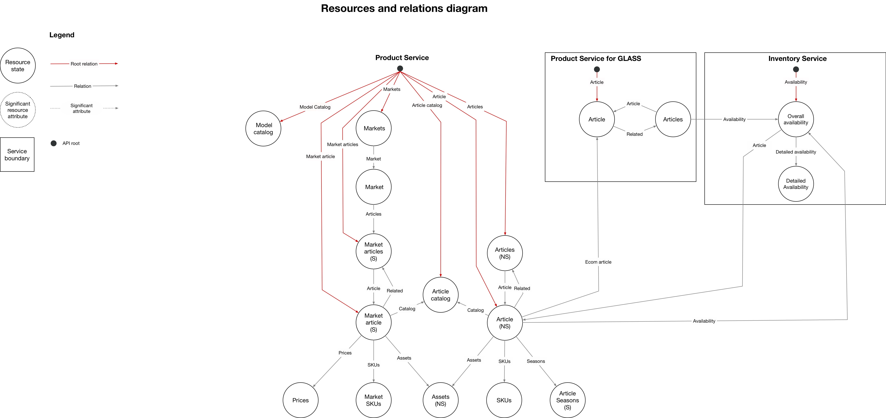

# Product Service API
Proposal of a Future Product Service API.



## Supermodel Data Model
The data model of the adidas product domain and this API is defined using
Supermodel Model that is a JSON Schema in YAML representation. These models are
defined in the `supermodel/adidas` directory.

To compile the data model for use in OpenAPI Spec 2.0, install the Supermodel
CLI tool:

```
$ npm i -g supermodel-cli
```

and then run:

```
$ supermodel schema oas2 supermodel/adidas -o product-service.yaml
```
